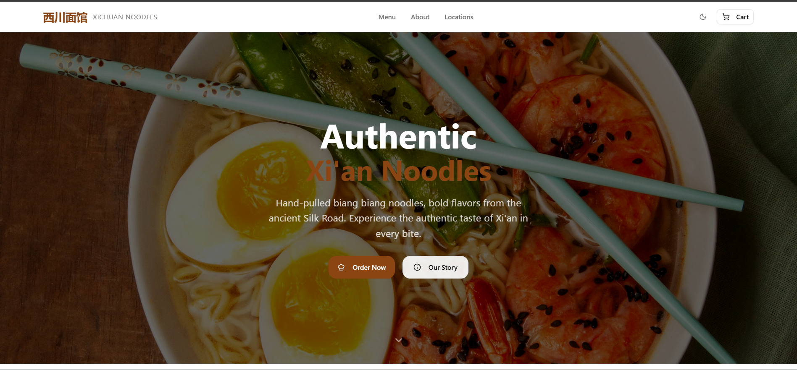
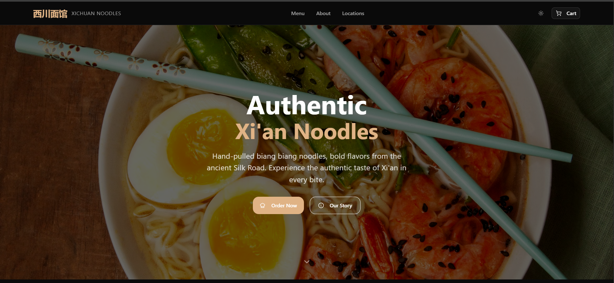
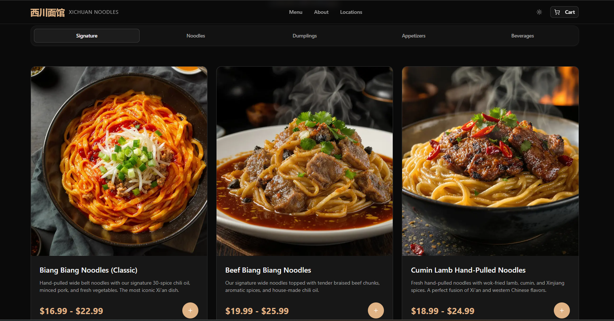
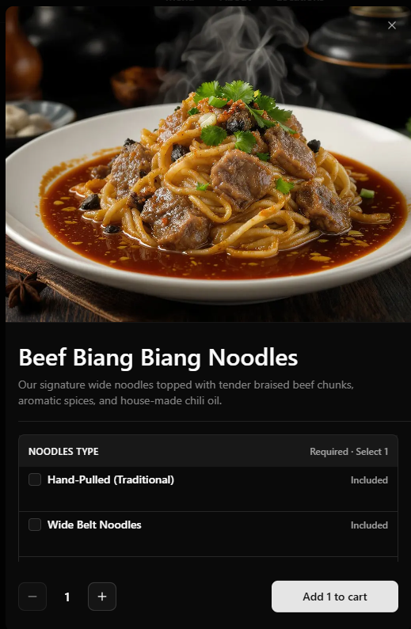
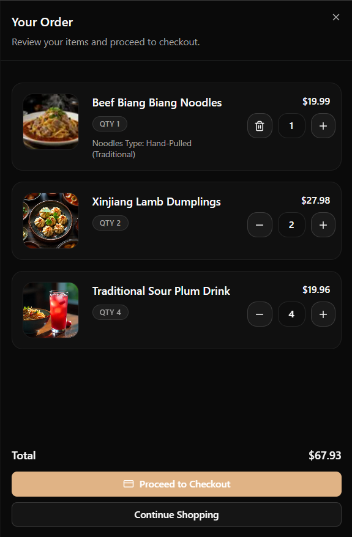

# Crave.js - Xichuan Noodles Storefront Template

A production-ready Crave.js storefront tailored for Xichuan noodle houses. Built on Next.js 15, it delivers branded menu browsing, cart management, and theme customization while staying lean enough for instant Vercel deployments.

[](https://vercel.com/new/clone?repository-url=https://github.com/craveup/xichuan-noodles-cravejs-nextjs-template&project-name=xichuan-noodles-storefront&env=NEXT_PUBLIC_CRAVEUP_API_KEY,NEXT_PUBLIC_LOCATION_ID,NEXT_PUBLIC_GOOGLE_MAPS_API_KEY,NEXT_PUBLIC_ORG_SLUG)

## Tech Stack

- [Next.js 15 (App Router)](https://nextjs.org/)
- [React 19](https://react.dev/)
- [TypeScript](https://www.typescriptlang.org/)
- [Tailwind CSS](https://tailwindcss.com/) with design tokens
- [shadcn/ui](https://ui.shadcn.com/) + Radix UI primitives
- [CraveUp Storefront SDK](https://docs.craveup.com/)

## Key Features

- Dynamic menu, product, and location data fetched with `@tanstack/react-query`
- Cart provider that gracefully falls back to local state when APIs are unavailable
- Theme engine powered by JSON files for rapid brand swaps
- Location-focused hero and CTA flow tailored to restaurants and dark kitchens
- Mobile-first drawer, category navigation, and product dialogs
- shadcn/ui + Radix primitives for accessible dialogs, drawers, and forms
- Zero-config Vercel deployment plus `.env.example` for easy onboarding

## Demo

- Live storefront: [https://xichuan-noodles.order.page/](https://xichuan-noodles.order.page/)

Capture the following states and drop the assets into `public/screenshots/`:

| Hero (Light)                                     | Hero (Dark)                                    |
| ------------------------------------------------ | ---------------------------------------------- |
|  |  |

| Menu Grid                                      | Product Drawer                                           |
| ---------------------------------------------- | -------------------------------------------------------- |
|  |  |

| Cart & Recommendations                               | Menu Scroll GIF                                        |
| ---------------------------------------------------- | ------------------------------------------------------ |
|  |  |

## Getting Started

1. **Clone the template**
   ```bash
   git clone https://github.com/your-org/xichuan-noodles-template
   cd xichuan-noodles-template
   ```
2. **Install dependencies**
   ```bash
   npm install
   ```
3. **Create your env file** (details below)
4. **Run the dev server**
   ```bash
   npm run dev
   ```
   Visit `http://localhost:3000` to explore the storefront.

## Environment Variables

Environment variables live in `.env.local`. Start by copying the template file:

```bash
cp .env.example .env.local
```

Then replace the placeholders with your credentials:

- `NEXT_PUBLIC_CRAVEUP_API_KEY` - required for menu, cart, and availability data
- `NEXT_PUBLIC_LOCATION_ID` - required to scope all menu queries to a single restaurant
- `NEXT_PUBLIC_ORG_SLUG` - optional, unlocks richer branding metadata
- `NEXT_PUBLIC_GOOGLE_MAPS_API_KEY` - optional, powers the embedded map module

> Need CraveUp sandbox credentials? Email [hello@craveup.com](mailto:hello@craveup.com) and mention the Xichuan template deployment.

## Scripts

| Command         | Description                          |
| --------------- | ------------------------------------ |
| `pnpm dev`   | Start the local development server   |
| `pnpm build` | Create an optimized production build |
| `pnpm start` | Serve the production build locally   |
| `pnpm lint`  | Run ESLint using the Next.js config  |

## Project Structure

```
.
|- public/
|  |- images/xichuan-noodles/      # Hero + menu imagery
|  |- themes/                      # JSON theme presets
|- src/
|  |- app/                         # App Router entry + sections
|  |- app/components/              # Hero, menu, cart, footer, etc.
|  |- app/providers/               # Cart + React Query providers
|  |- components/ui/               # Tailored shadcn/ui primitives
|  |- hooks/                       # Cart + theme hooks
|  |- lib/                         # Storefront client and helpers
|- README.md
```

## Customization Guide

1. **Branding and imagery** - Replace assets in `public/images/xichuan-noodles` with your photography.
2. **Theme presets** - Update or add JSON files inside `public/themes` to match your color system.
3. **Copy and layout** - Tweak hero, menu, and footer content under `src/app/components`.
4. **Menu data** - Manage categories and items through the CraveUp dashboard; the template consumes live data.
5. **UI primitives** - Extend buttons, drawers, and dialogs in `src/components/ui` if you need additional states.

## Deployment

1. Commit and push your repository to GitHub (or another Git provider).
2. Visit [vercel.com/new](https://vercel.com/new) and import the repository.
3. Add the same environment variables to the Vercel project settings.
4. Click **Deploy** and share the live storefront URL with stakeholders.

## Support & Reference

- [CraveUp Docs](https://docs.craveup.com/)
- [Next.js Documentation](https://nextjs.org/docs)
- [Tailwind CSS Docs](https://tailwindcss.com/docs)
- [shadcn/ui Documentation](https://ui.shadcn.com/)
- [Radix UI Documentation](https://www.radix-ui.com/primitives/docs)

## Next Steps

1. Populate `.env.local` with your CraveUp credentials and optional Google Maps key.
2. Configure menu imagery, hero copy, and CTAs for your restaurant.
3. Add additional sections or pages in `src/app` if you need loyalty, catering, or reservations flows.

## License

Distributed under the MIT License. See `LICENSE` for details.
